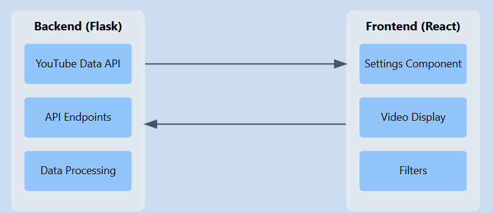
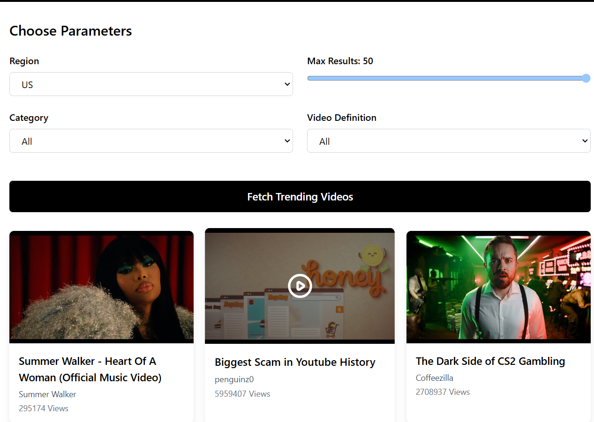

Here’s the updated README in code form:

```markdown
# **YouTube Trending Analyzer**

A web application that fetches and displays trending YouTube videos based on user-defined settings. The app leverages the **YouTube Data API**, with a Flask-based backend and a React-based frontend, to provide real-time trending insights.

## **Architecture Overview**



---

## **Project Overview**
This project is designed to fetch trending YouTube videos, categorize them, and display them in a user-friendly interface. It features:
1. A **backend** powered by Flask, hosted on Render.
2. A **frontend** built using React, styled with Tailwind CSS, and hosted on Vercel.
3. Integration with **Google Cloud's YouTube Data API** for efficient data retrieval.



---

## **Backend**
The backend is built with Flask and deployed on **Render**. It handles the following functionalities:

### **Endpoints**:
1. `/api/trending`:
   - Fetches trending YouTube videos for a specified region, category, and other filters.
2. `/api/categories`:
   - Fetches video categories to help users filter videos meaningfully.

### **Features**:
- **Dynamic API Integration**:
  - The backend communicates with Google Cloud’s **YouTube Data API** to retrieve real-time trending video data.
- **Efficient Use of Google Cloud**:
  - Parameters like region, category, and video definition are passed dynamically to minimize API calls and fetch only the required data.
- **Environment Variable Integration**:
  - The API key is securely stored in a `.env` file, ensuring security and ease of configuration.
- **CORS Enabled**:
  - Allows cross-origin requests, enabling seamless communication between the frontend and backend.

---

## **Frontend**
The frontend is built with React, styled with Tailwind CSS, and hosted on **Vercel**.

### **Key Features**:
1. **Dynamic Filters**:
   - Users can customize the results by selecting region, category, video definition (HD/SD), and maximum results.
2. **Responsive UI**:
   - Designed to work seamlessly across devices with modern styling.
3. **Real-Time Updates**:
   - Fetches and displays trending videos dynamically.

### **Components**:
1. **Settings**:
   - Allows users to adjust filters like region, category, and video quality.
2. **TrendingVideos**:
   - Displays fetched videos with thumbnails, titles, and view counts.

---

## **Jupyter Notebook (`model.ipynb`)**
The **Jupyter Notebook** serves as a playground for exploring and debugging functionalities. It contains the following:

### **1. Fetching YouTube Trending Videos**
- **Functionality**:
  - A function (`get_trending_videos`) interacts with the YouTube Data API to fetch trending video details like titles, views, thumbnails, and channel names.
  - Parameters such as `regionCode`, `maxResults`, and `videoDefinition` allow dynamic customization.

---

### **2. Mapping Video Categories**
- **Functionality**:
  - Another function (`get_category_mapping`) fetches YouTube video categories for a specific region.
  - Categories (e.g., Music, Gaming, Education) are mapped to their respective IDs.

---

### **3. Data Analysis**
- **Functionality**:
  - Uses **Pandas** to process and clean the fetched data.
  - Saves the trending video data into a CSV file (`trending_videos.csv`).

---

### **4. Debugging & Visualization**
- **Functionality**:
  - Basic data visualization using libraries like Matplotlib or Seaborn (optional).

---

## **How This Works**
1. **Efficient API Usage**:
   - The app dynamically filters and fetches data based on user preferences, reducing unnecessary API calls and saving quota.
2. **Secure Environment Variables**:
   - The API key is kept secure using `.env` and not hardcoded into the codebase.

---

## **Docker**

The backend can also be containerized using Docker to ensure consistency across development and production environments.

### **Steps to Use Docker**:

1. **Ensure Docker is Installed**
   - Install Docker from the [official Docker website](https://www.docker.com/get-started).

2. **Build the Docker Image**
   ```bash
   cd backend
   docker build -t youtube-trending-analyzer-backend .
   ```

3. **Run the Docker Container**
   ```bash
   docker run -p 5000:5000 --env-file .env youtube-trending-analyzer-backend
   ```

4. **Access the Backend**
   - Open `http://localhost:5000` to access the backend API.

5. **Frontend with Docker (Optional)**
   - Similarly, the frontend can be containerized if needed. Add a Dockerfile to the `frontend` directory and follow the same steps.

> **Note**: Ensure that your `.env` file is correctly set up before running the Docker container.

---

## **Tech Stack**
- **Backend**: Flask, Python
- **Frontend**: React, Tailwind CSS
- **API**: YouTube Data API v3
- **Deployment**: 
  - Backend: Render
  - Frontend: Vercel

## **Getting Started**

### Prerequisites
- Python 3.8+
- Node.js 14+
- YouTube Data API key

### Installation

1. **Clone the repository**
```bash
git clone https://github.com/dhananjay6561/TubeMetrics---Youtube-Trends-Analyser
cd TubeMetrics---Youtube-Trends-Analyser
```

2. **Backend Setup**
```bash
cd backend
python -m venv venv
source venv/bin/activate  # On Windows: .\venv\Scripts\activate
pip install -r requirements.txt

# Configure environment variables
cp .env.example .env
# Add your YouTube API key to .env
```

3. **Frontend Setup**
```bash
cd frontend
npm install
```

## **Running the Application**

1. **Start the Backend**
```bash
# From the backend directory
python app.py
```

2. **Start the Frontend**
```bash
# From the frontend directory
npm run dev
```

3. Visit `http://localhost:3000` in your browser

## **How to Contribute**

We welcome contributions! Here's how you can help:

### Setting Up Development Environment

1. **Fork and Clone**
```bash
git clone https://github.com/dhananjay6561/TubeMetrics---Youtube-Trends-Analyser
cd TubeMetrics---Youtube-Trends-Analyser
git checkout -b feature/your-feature-name
```

2. **Install Dependencies**
```bash
# Backend
cd backend
python -m venv venv
source venv/bin/activate
pip install -r requirements.txt

# Frontend
cd ../frontend
npm install
```

### Making Changes

1. **Code Style**
- Follow PEP 8 for Python code
- Use ESLint and Prettier for JavaScript/React
- Write meaningful commit messages (Conventional Commits)
- Add appropriate comments and documentation

2. **Testing**
```bash
# Run backend tests
python -m pytest

# Run frontend tests
npm test
```

3. **Submitting Changes**
```bash
git add .
git commit -m "feat: Add your feature description"
git push origin feature/your-feature-name
```

4. Create a Pull Request:
   - Go to GitHub
   - Click "New Pull Request"
   - Select your feature branch
   - Describe your changes
   - Link related issues

### Guidelines
- Write clean, documented code
- Add tests for new features
- Update documentation
- Follow existing code style
- Create issues for major changes
- Review existing issues and PRs

---

## **Future Improvements**
1. **Enhanced Visualization**:
   - Add interactive charts to display video trends and analytics.
2. **Pagination**:
   - Handle large datasets efficiently.
3. **Authentication**:
   - Add user accounts to save preferences and history.
4. **Dark Mode**:
   - Provide better accessibility and aesthetics.

---

## **Contact**
- GitHub Issues: [Project Issues](https://github.com/dhananjay6561/TubeMetrics---Youtube-Trends-Analyser/issues)
- Email: dhananjayaggarwal6561@gmail.com

## **Acknowledgments**
- YouTube Data API
- Contributors and maintainers
- Open source community

---

## **Outro**
This project demonstrates the integration of React, Flask, and the YouTube Data API to create a modern, data-driven web application. Contributions and feedback are welcome!
```